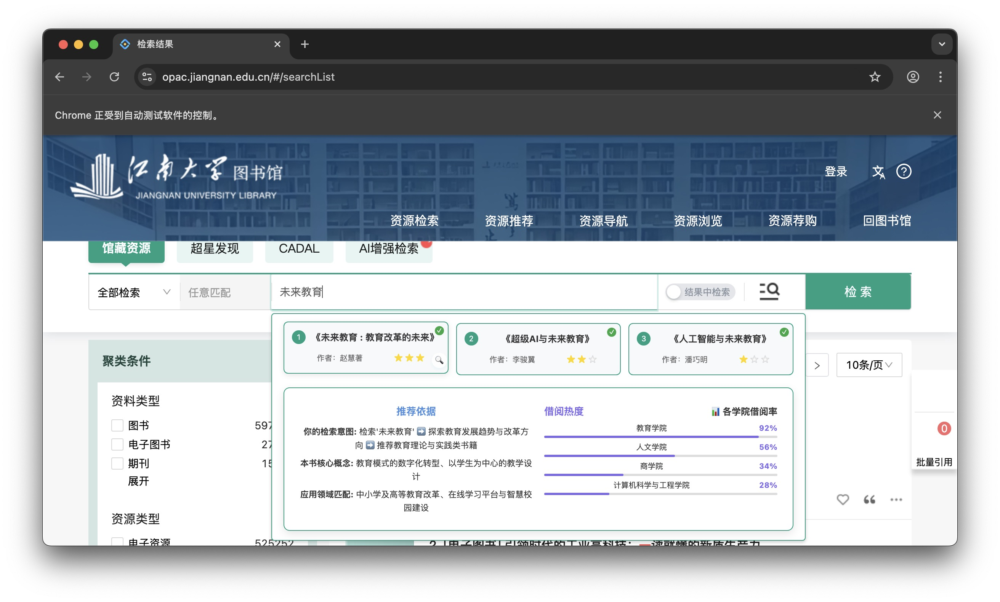

# 江南大学图书馆检索系统输入词监听与智能AI提示关键词（实验程序代码项目）

## 📁 文件结构

```
.
├── web_monitor.py             # 主服务，Selenium控制和API服务器
├── spark.py                   # 星火LLM集成
├── qwen.py                    # 千问LLM集成
├── openai.py                  # OpenAI LLM集成
├── show_books_with_reasons.js # 新版UI组件（用于测试页面）
├── suggestion_display.js      # 旧版UI组件（用于测试页面）
├── requirements.txt           # Python依赖
├── start_services.sh          # 启动脚本
├── stop_services.sh           # 停止脚本
├── README.md                  # 本文档
└── tests/
这个项目实现本地监听网页输入行为并提供智能反馈提示关键词。

## 功能特点

- 监听网页中的所有输入字段，包括输入框和文本域（目标网页https://opac.jiangnan.edu.cn/#/Home）
- 捕获用户输入内容并发送到本地服务器
- 使用大语言模型API生成智能输入建议（待更新：可以升级为三本书发送三次请求以便快速响应，加入实时更新字段在前端并返回，当有字段的时候就加载完成）
- 在网页上显示实时建议反馈

## 技术架构

- **后端**: `Python` + `Flask`
  - 作为API服务器，接收前端请求，并行调用LLM并返回结构化数据。【带优化转为流式输出返回字符】
- **核心驱动**: `Selenium`
  - 用于自动化浏览器操作，将前端监控脚本动态注入到目标网页。
- **前端注入**: `JavaScript`
  - 注入到目标网页的脚本，负责监听用户输入、调用后端API、并将返回的数据渲染成推荐理由UI。
- **LLM集成**: `spark.py`, `qwen.py`, `openai.py`
  - 模块化设计，每个文件负责与一个特定的大模型API进行交互。

## 安装步骤

1. 安装Python依赖：

```bash
pip install -r requirements.txt
```

2. 确保安装了Chrome浏览器（Selenium需要）

## 使用方法

### 启动服务

1. 使用启动脚本（推荐）：

```bash
chmod +x start_services.sh
./start_services.sh
```

或者手动启动：

```bash
python web_monitor.py
```

2. 服务将自动启动Chrome浏览器并打开配置的网页(默认为http://localhost:3000)

3. 当你在网页中输入内容时，系统会自动分析输入并提供建议

### 停止服务

使用停止脚本：

```bash
chmod +x stop_services.sh
./stop_services.sh
```

或者使用 `Ctrl+C` 在运行服务的终端中停止。

**Windows 终端停止服务：**

在 PowerShell 或 CMD 中执行以下命令：

```powershell
# 停止端口 5001 上的服务
netstat -ano | findstr :5001
# 找到对应的 PID，然后执行（替换 <PID> 为实际的进程ID）
taskkill /F /PID <PID>
```

### 端口配置

- **Flask API 服务端口**: `5001` (在 `web_monitor.py` 第508行配置)
- 如需修改端口，请编辑 `web_monitor.py` 文件中的端口设置

## 🎯 效果展示

### 系统运行截图


*图1：系统运行时的浏览器界面，显示智能提示功能*


*图2：用户在输入框输入时显示的智能建议弹窗*

### 交互统计面板


*图3：用户交互统计和数据分析面板*

### 功能演示视频

> 📹 **演示视频**: [点击查看完整功能演示](https://your-video-link.com)

### 快速体验

1. 启动系统后，浏览器会自动打开目标网页
2. 在搜索框中输入任意关键词（如："机器学习"、"Python编程"）
3. 观察智能建议的实时生成和显示
4. 查看交互统计面板了解使用情况

实验辅助说明：
设备（非实验平台相关）：脑电仪ETG、眼动仪SMI
被试：本硕学生40名左右，专业学科不限
